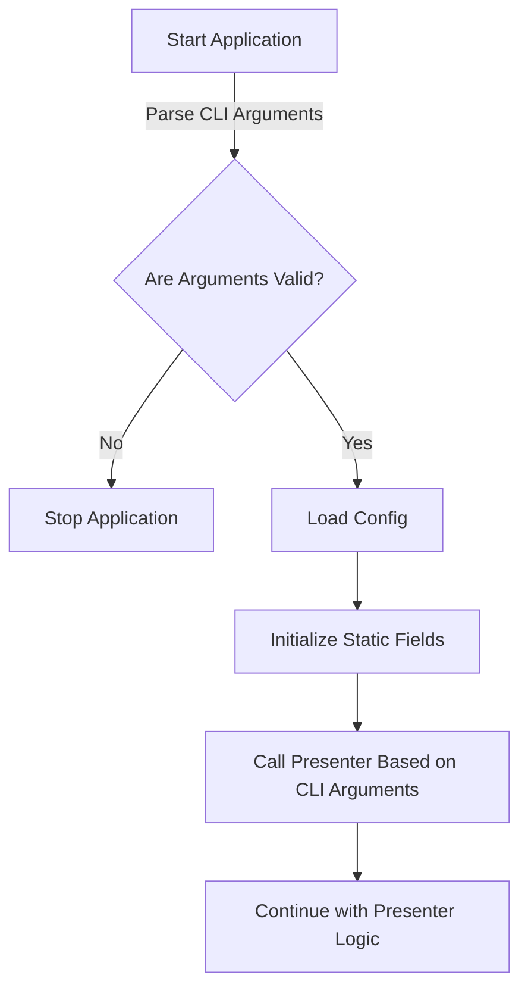

# Dokumentace

## Struktura projektu

Aplikace používá [MVP architekturu](https://en.wikipedia.org/wiki/Model%E2%80%93view%E2%80%93presenter). Kde Modely jsou ve `Model`, Presenters ve `Presenter`, Views ve `View`.

## Knihovny

- [**SpectreConsole**](https://spectreconsole.net)
  - TUI
- [**sqlite-net-pcl**](https://github.com/praeclarum/sqlite-net)
  - SQLite knihovna s podporou ORM
- [**System.CommandLine**](https://learn.microsoft.com/en-us/dotnet/standard/commandline)
  - Knihovna na parsování CLI argumentů

## Cyklus aplikace

## Presenters

- CliPresenter
  - Hlavní presenter, který se aktivuje, pokud aplikace není spuštěna s příkazem `ui`
- MenuPresenter
  - Hlavní presenter, který se aktivuje, když je aplikace spuštěna s příkazem `ui`
- Cli...Presenter, UI...Presenter
  - Tyto presentery jsou odpovědné za konkrétní funkce aplikace. Například:
    - CliTaskAddPresenter přidává nový úkol na základě dat zadaných v terminálu
    - UITaskAddPresenter přidává nový úkol na základě dat zadaných uživatelem prostřednictvím TUI

## Models

- TaskModel
  - Poskytuje funkce pro správu úkolů, jako je přidávání, odebírání, úprava a filtrování úkolů
- TimerModel
  - Umožňuje práci s časovači
- TaskTimerModel
  - Slouží k propojení úkolů s časovači
- Prompt
  - Slouží k získání dat od uživatele pomocí TUI
